<!--
 * @Author: 王伟
 * @Date: 2020-10-18 18:56:27
 * @LastEditTime: 2020-10-18 20:02:40
 * @LastEditors: Please set LastEditors
 * @Description: In User Settings Edit
 * @FilePath: /wangwei-gold.github.io/RPC/基础知识/serializbale.md
-->
## 序列化知识学习

### 序列化是什么
序列化的原本意图是希望对一个Java对象作一下“变换”，变成字节序列，这样一来方便持久化存储到磁盘，避免程序运行结束后对象就从内存里消失，另外变换成字节序列也更便于网络运输和传播，所以概念上很好理解：

* 序列化：把Java对象转换为字节序列。
* 反序列化：把字节序列恢复为原先的Java对象。

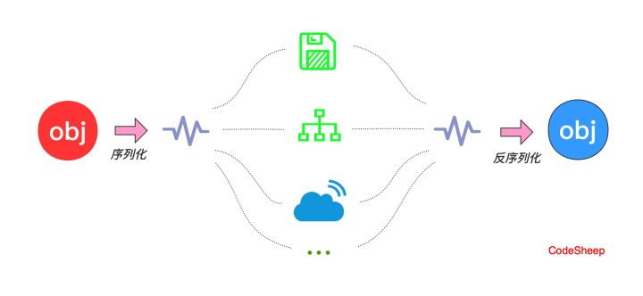

### 对象如何序列化?

然而Java目前并没有一个关键字可以直接去定义一个所谓的“可持久化”对象。

对象的持久化和反持久化需要靠程序员在代码里手动显式地进行序列化和反序列化还原的动作。

举个例子，假如我们要对Student类对象序列化到一个名为student.txt的文本文件中，然后再通过文本文件反序列化成Student类对象：

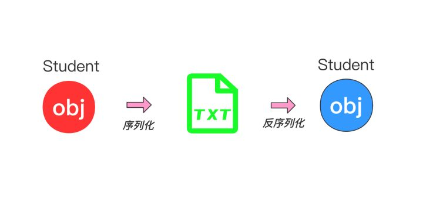

### Serializable接口有何用?
Serializable是一个空接口, 怎么实现序列化的?
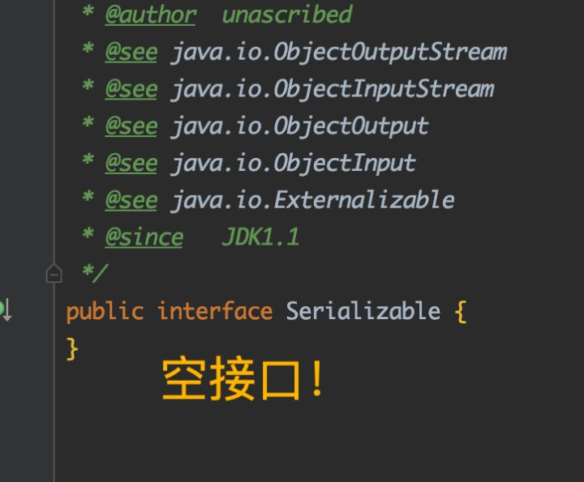
由源码一直跟到ObjectOutputStream的writeObject0()方法底层一看，Serializable只是一个标记
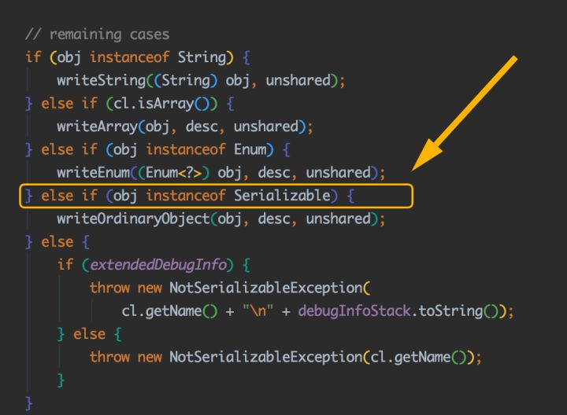

### serialVersionUID的作用

### 单例模式
序列化破坏单例模式

一个单例对象创建好后，有时候需要将对象序列化然后写入磁盘， 下次使用时再从磁盘中读取对象并进行反序列化，将其转化为内存对 象。反序列化后的对象会重新分配内存，即重新创建。如果序列化的目 标对象为单例对象，就违背了单例模式的初衷，相当于破坏了单例，来 看一段代码：

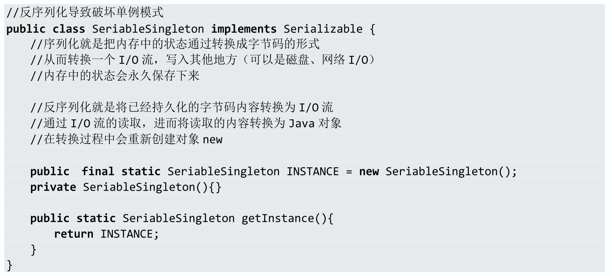

编写测试代码：

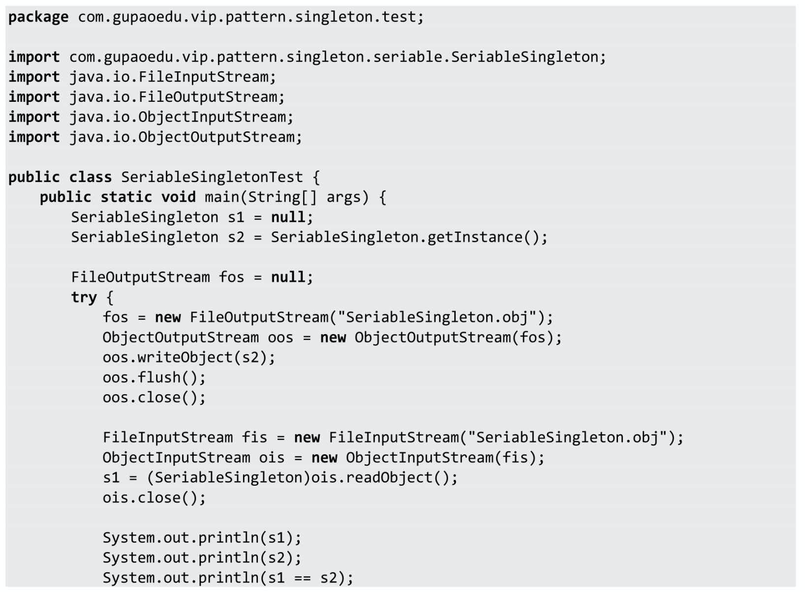

运行结果如下图所示。

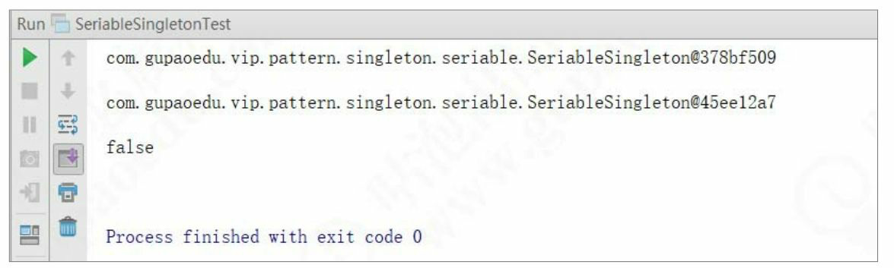

从运行结果可以看出，反序列化后的对象和手动创建的对象是不一 致的，实例化了两次，违背了单例模式的设计初衷。那么，我们如何保 证在序列化的情况下也能够实现单例模式呢？其实很简单，只需要增加 readResolve（）方法即可。来看优化后的代码：

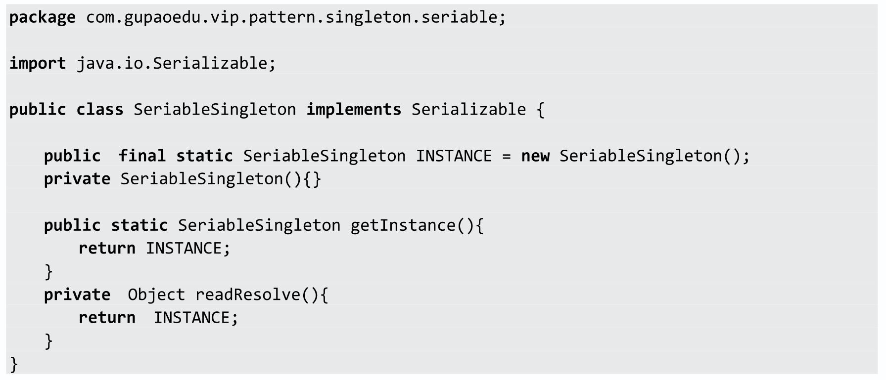

再看运行结果，如下图所示。

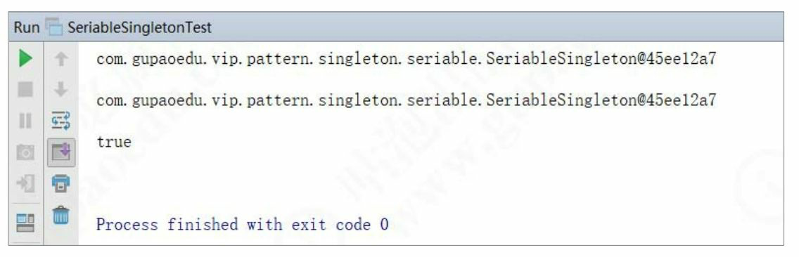

大家一定会想：这是什么原因呢？为什么要这样写？看上去很神奇 的样子，也让人有些费解。不如我们一起来看看JDK 的源码实现以了解 清楚。我们进入ObjectInputStream类的readObject（）方法，代码如下： 

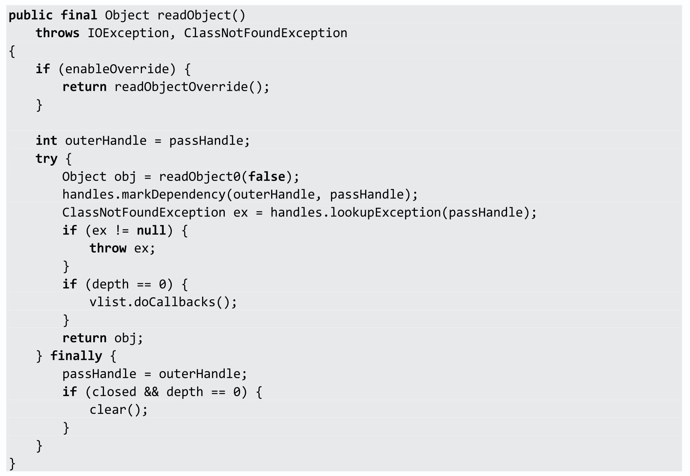

我们发现，在readObject（）方法中又调用了重写的 readObject0（）方法。进入readObject0（）方法，代码如下：

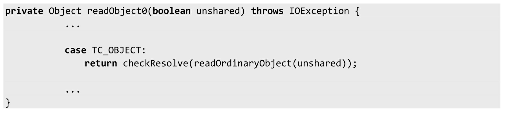

我们看到TC_OBJECT中调用了ObjectInputStream的 readOrdinaryObject（）方法，看源码：

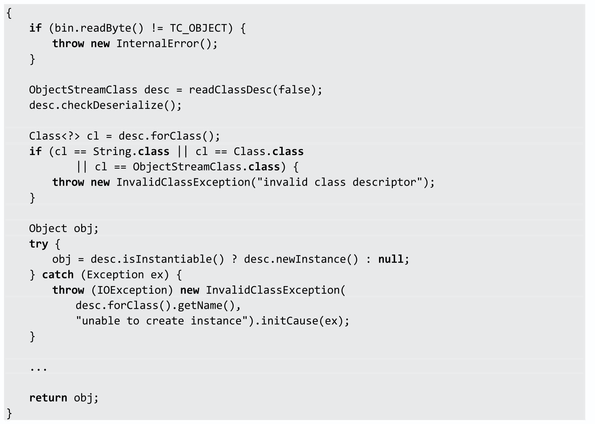

我们发现调用了ObjectStreamClass的isInstantiable（）方法，而 isInstantiable（）方法的代码如下：

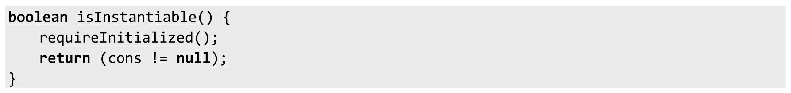

上述代码非常简单，就是判断一下构造方法是否为空，构造方法不 为空就返回 true。这意味着只要有无参构造方法就会实例化。

这时候其实还没有找到加上 readResolve（）方法就避免了单例模式

被破坏的真正原因。再回到ObjectInputStream的readOrdinaryObject（） 方法，继续往下看：

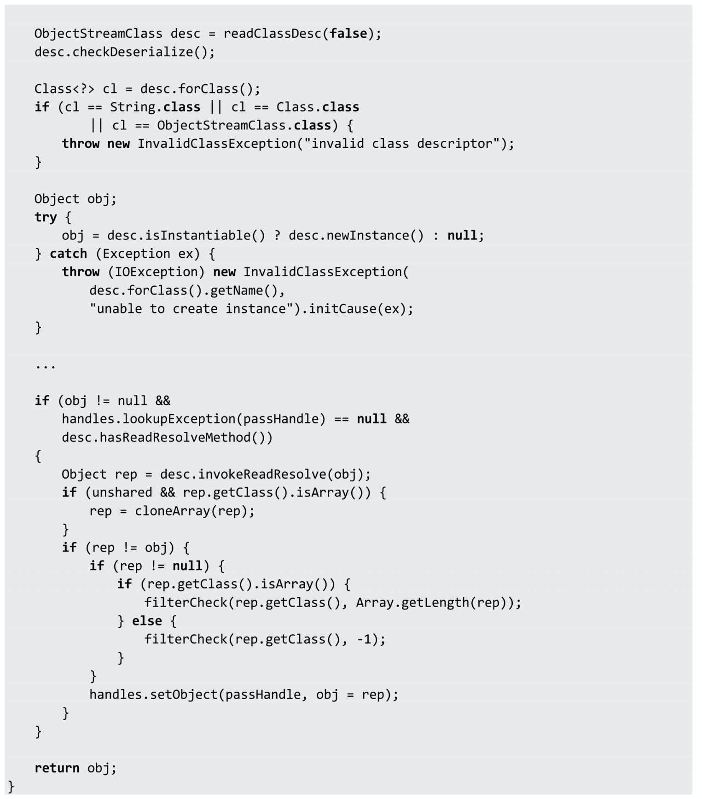

判断无参构造方法是否存在之后，又调用了 hasReadResolveMethod（）方法，来看代码：

上述代码逻辑非常简单，就是判断 readResolveMethod 是否为空， 不为空就返回 true。那么readResolveMethod 是在哪里赋值的呢？通过全 局查找知道，在私有方法 ObjectStreamClass（）中给readResolveMethod 进行了赋值，来看代码：

上面的逻辑其实就是通过反射找到一个无参的 readResolve（）方 法，并且保存下来。现在回到ObjectInputStream 的 readOrdinaryObject（）方法继续往下看，如果 readResolve（）方法存在 则调用invokeReadResolve（）方法，来看代码：

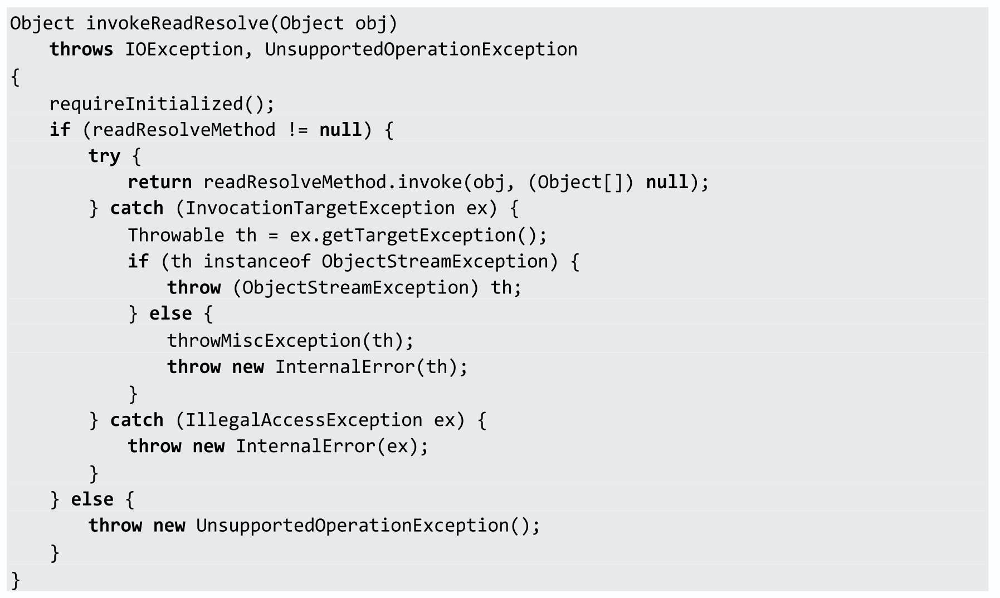

仅供学习和交流，请购买正版支持本书作者

我们可以看到，在invokeReadResolve（）方法中用反射调用了 readResolveMethod方法。

通过JDK源码分析我们可以看出，虽然增加readResolve（）方法返 回实例解决了单例模式被破坏的问题，但是实际上实例化了两次，只不 过新创建的对象没有被返回而已。如果创建对象的动作发生频率加快， 就意味着内存分配开销也会随之增大，难道真的就没办法从根本上解决 问题吗？下面讲的注册式单例也许能帮助到你。
